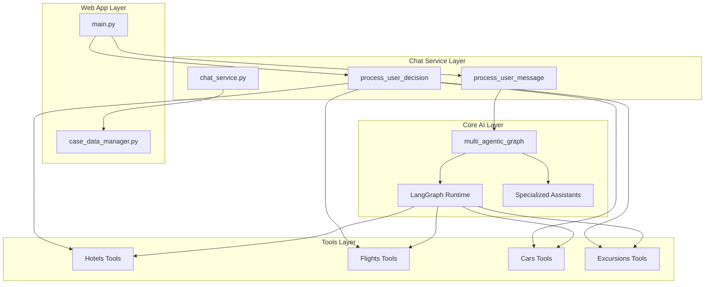
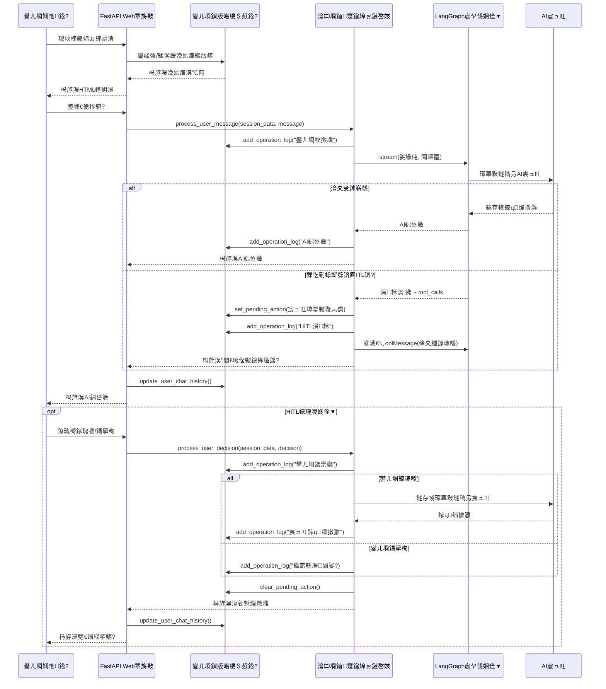

# Web App Module 娣卞害鍒嗘瀽鏂囨。

## 姒傝堪

`console_web` 妯″潡鏄鏅鸿兘浣?RAG 瀹㈡埛鏀寔绯荤粺鐨?Web 鍓嶇鎺ュ彛锛屾彁渚涗簡涓€涓熀浜?FastAPI 鐨勭幇浠ｅ寲 Web 搴旂敤绋嬪簭锛屼娇鐢ㄦ埛鑳藉閫氳繃娴忚鍣ㄤ笌澶氭櫤鑳戒綋瀹㈡埛鏀寔绯荤粺杩涜浜や簰銆傝妯″潡瀹炵幇浜嗗畬鏁寸殑浼氳瘽绠＄悊銆佸疄鏃惰亰澶╃晫闈€佷汉宸ュ湪鍥炶矾(HITL)鎵瑰噯娴佺▼浠ュ強鎿嶄綔鏃ュ織鍔熻兘銆?

## 椤圭洰缁撴瀯鍒嗘瀽

```
console_web/
鈹溾攢鈹€ app/
鈹?  鈹溾攢鈹€ core/
鈹?  鈹?  鈹溾攢鈹€ __init__.py                 # 鍖呭垵濮嬪寲鏂囦欢
鈹?  鈹?  鈹斺攢鈹€ case_data_manager.py        # 鐢ㄦ埛鏁版嵁绠＄悊鏍稿績妯″潡
鈹?  鈹溾攢鈹€ templates/
鈹?  鈹?  鈹斺攢鈹€ chat.html                   # 鑱婂ぉ鐣岄潰HTML妯℃澘
鈹?  鈹溾攢鈹€ __init__.py                     # 搴旂敤鍖呭垵濮嬪寲
鈹?  鈹斺攢鈹€ main.py                         # FastAPI搴旂敤涓诲叆鍙?
鈹溾攢鈹€ case_data/                          # 鐢ㄦ埛浼氳瘽鏁版嵁瀛樺偍鐩綍
鈹?  鈹溾攢鈹€ *.json                          # 鍚勭敤鎴蜂細璇濇暟鎹枃浠?
鈹?  鈹斺攢鈹€ test_session.json               # 娴嬭瘯浼氳瘽鏁版嵁绀轰緥
鈹溾攢鈹€ README.md                           # 妯″潡璇存槑鏂囨。
鈹斺攢鈹€ pyproject.toml                      # Python椤圭洰閰嶇疆鏂囦欢
```

## 鏍稿績缁勪欢璇︾粏鍒嗘瀽

### 1. 涓诲簲鐢ㄧ▼搴?(main.py)

#### 1.1 搴旂敤鏋舵瀯
- **妗嗘灦**: FastAPI (鐜颁唬銆侀珮鎬ц兘鐨凱ython Web妗嗘灦)
- **妯℃澘寮曟搸**: Jinja2 (鐢ㄤ簬娓叉煋HTML妯℃澘)
- **浼氳瘽绠＄悊**: Cookie-based session management
- **鏁版嵁鎸佷箙鍖?*: JSON鏂囦欢瀛樺偍绯荤粺

#### 1.2 鏍稿績鍔熻兘妯″潡

**渚濊禆绠＄悊**:
```python
# 鍔ㄦ€佽矾寰勬坊鍔狅紝纭繚鑳藉璁块棶ecommerce_support_agent妯″潡
sys.path.append(os.path.join(os.path.dirname(__file__), "..", ".."))
from ecommerce_support_agent.app.services.chat_service import process_user_message
```

**浼氳瘽鏁版嵁缁撴瀯**:
```python
def get_session_data(request: Request):
    """鑾峰彇鎴栧垱寤哄綋鍓嶇敤鎴风殑浼氳瘽鏁版嵁"""
    session_id = request.cookies.get("session_id")
    if not session_id:
        session_id = str(uuid.uuid4())  # 鐢熸垚鍞竴浼氳瘽ID
    
    session_data = get_user_session(session_id)
    
    # 纭繚閰嶇疆淇℃伅瀛樺湪
    if "config" not in session_data:
        session_data["config"] = {
            "thread_id": session_id,        # LangGraph绾跨▼ID
            "passenger_id": "5102 899977"   # 榛樿涔樺ID
        }
```

#### 1.3 API绔偣鍒嗘瀽

**涓昏绔偣**:

1. **GET /** - 鑱婂ぉ鐣岄潰
   - 杩斿洖鑱婂ぉ鐣岄潰HTML椤甸潰
   - 璁剧疆浼氳瘽Cookie
   - 鍔犺浇鍘嗗彶鑱婂ぉ璁板綍

2. **POST /chat** - 娑堟伅澶勭悊
   - 鎺ユ敹鐢ㄦ埛娑堟伅
   - 閫氳繃澶氭櫤鑳戒綋绯荤粺澶勭悊
   - 鏇存柊鑱婂ぉ鍘嗗彶
   - 杩斿洖AI鍝嶅簲

3. **GET /pending-action** - 妫€鏌ュ緟澶勭悊鎿嶄綔
   - 妫€鏌ユ槸鍚︽湁闇€瑕佺敤鎴锋壒鍑嗙殑鎿嶄綔
   - 鏀寔HITL宸ヤ綔娴佺▼

4. **POST /approve-action** - 鎵瑰噯鎿嶄綔
   - 澶勭悊鐢ㄦ埛鎵瑰噯鍐冲畾
   - 缁х画鎵ц琚殏鍋滅殑宸ヤ綔娴佺▼

5. **POST /reject-action** - 鎷掔粷鎿嶄綔
   - 澶勭悊鐢ㄦ埛鎷掔粷鍐冲畾
   - 缁堟褰撳墠鎿嶄綔娴佺▼

6. **GET /operation-log** - 鎿嶄綔鏃ュ織
   - 鑾峰彇浼氳瘽鎿嶄綔鏃ュ織
   - 鏀寔闄愬埗杩斿洖鏉＄洰鏁伴噺

### 2. 鐢ㄦ埛鏁版嵁绠＄悊鍣?(case_data_manager.py)

#### 2.1 鏁版嵁瀛樺偍璁捐
- **瀛樺偍鏂瑰紡**: 鍩轰簬鏂囦欢绯荤粺鐨凧SON瀛樺偍
- **鏂囦欢浣嶇疆**: `./case_data/user_sessions.json`
- **鏁版嵁闅旂**: 姣忎釜浼氳瘽ID瀵瑰簲鐙珛鐨勬暟鎹粨鏋?

#### 2.2 鏁版嵁缁撴瀯璁捐
```json
{
  "session_id": {
    "session_id": "鍞竴浼氳瘽鏍囪瘑绗?,
    "chat_history": [
      {
        "timestamp": "ISO鏍煎紡鏃堕棿鎴?,
        "user_message": "鐢ㄦ埛娑堟伅鍐呭",
        "ai_response": "AI鍝嶅簲鍐呭"
      }
    ],
    "pending_action": "寰呭鐞嗘搷浣滆鎯呮垨null",
    "user_decision": "鐢ㄦ埛鍐冲畾鎴杗ull",
    "operation_log": [
      {
        "timestamp": "鎿嶄綔鏃堕棿鎴?,
        "title": "鎿嶄綔鏍囬",
        "content": "鎿嶄綔鍐呭",
        "type": "鎿嶄綔绫诲瀷"
      }
    ],
    "created_at": "浼氳瘽鍒涘缓鏃堕棿"
  }
}
```

#### 2.3 鏍稿績鍔熻兘鍑芥暟

**浼氳瘽绠＄悊**:
- `get_user_session(session_id)`: 鑾峰彇鐢ㄦ埛浼氳瘽锛屼笉瀛樺湪鍒欏垱寤?
- `update_user_chat_history(session_id, user_message, ai_response)`: 鏇存柊鑱婂ぉ鍘嗗彶

**HITL鏀寔**:
- `set_pending_action(session_id, action_details)`: 璁剧疆寰呮壒鍑嗘搷浣?
- `get_pending_action(session_id)`: 鑾峰彇寰呮壒鍑嗘搷浣?
- `clear_pending_action(session_id)`: 娓呴櫎寰呮壒鍑嗘搷浣?
- `set_user_decision(session_id, decision)`: 璁剧疆鐢ㄦ埛鍐冲畾
- `get_user_decision(session_id)`: 鑾峰彇鐢ㄦ埛鍐冲畾

**鎿嶄綔鏃ュ織**:
- `add_operation_log(session_id, log_entry)`: 娣诲姞鎿嶄綔鏃ュ織鏉＄洰
- `get_operation_log(session_id, limit=50)`: 鑾峰彇鎿嶄綔鏃ュ織
- `clear_operation_log(session_id)`: 娓呴櫎鎿嶄綔鏃ュ織

### 3. 鍓嶇鐣岄潰 (chat.html)

#### 3.1 鐣岄潰璁捐
- **甯冨眬**: 鍙屾爮甯冨眬锛堣亰澶╁尯鍩?+ 鎿嶄綔鏃ュ織锛?
- **鍝嶅簲寮?*: 閫傞厤涓嶅悓灞忓箷灏哄
- **浜や簰鎬?*: 瀹炴椂娑堟伅鍙戦€佸拰鎺ユ敹
- **鍙鍖?*: 鍖哄垎鐢ㄦ埛娑堟伅鍜孉I鍝嶅簲鐨勬牱寮?

#### 3.2 鏍稿績JavaScript鍔熻兘

**娑堟伅澶勭悊**:
```javascript
async function sendMessage() {
    const message = userInput.value.trim();
    if (!message) return;
    
    // 绂佺敤杈撳叆骞舵樉绀哄姞杞芥寚绀哄櫒
    userInput.disabled = true;
    sendBtn.disabled = true;
    loadingIndicator.style.display = 'block';
    
    try {
        addMessage('user', message);
        userInput.value = '';
        
        const response = await fetch('/chat', {
            method: 'POST',
            headers: { 'Content-Type': 'application/json' },
            body: JSON.stringify({ message: message })
        });
        
        const data = await response.json();
        
        if (data.error) {
            addMessage('assistant', `Error: ${data.error}`);
        } else {
            addMessage('assistant', data.response);
        }
    } catch (error) {
        addMessage('assistant', 'An unexpected error occurred. Please try again later.');
        console.error('Error:', error);
    } finally {
        // 閲嶆柊鍚敤杈撳叆骞堕殣钘忓姞杞芥寚绀哄櫒
        userInput.disabled = false;
        sendBtn.disabled = false;
        loadingIndicator.style.display = 'none';
        userInput.focus();
    }
}
```

**HITL澶勭悊**:
```javascript
async function checkPendingAction() {
    try {
        const response = await fetch('/pending-action');
        const data = await response.json();
        
        if (data.pending_action) {
            // 鏄剧ず寰呮壒鍑嗘搷浣滄ā鎬佹
            let detailsHTML = '<h4>Tool Calls:</h4><ul>';
            data.pending_action.tool_calls.forEach(toolCall => {
                detailsHTML += `<li><strong>${toolCall.name}</strong>: ${JSON.stringify(toolCall.args)}</li>`;
            });
            detailsHTML += '</ul>';
            pendingActionDetails.innerHTML = detailsHTML;
            pendingActionModal.style.display = 'block';
        }
    } catch (error) {
        console.error('Error checking pending action:', error);
    }
}
```

**鎿嶄綔鏃ュ織鏄剧ず**:
```javascript
function displayOperationLog(logEntries) {
    if (!logEntries || logEntries.length === 0) {
        operationLogContent.innerHTML = '<div class="log-entry">No operation log entries</div>';
        return;
    }
    
    let logHTML = '';
    logEntries.forEach(entry => {
        const timestamp = new Date(entry.timestamp).toLocaleTimeString();
        logHTML += `
            <div class="log-entry ${entry.type}">
                <div class="log-title">${entry.title}</div>
                <div class="log-content">${entry.content}</div>
                <div class="log-timestamp">${timestamp}</div>
            </div>
        `;
    });
    
    operationLogContent.innerHTML = logHTML;
}
```

## 绯荤粺闆嗘垚涓庡伐浣滄祦绋?

### 1. 涓庝富绯荤粺鐨勯泦鎴?

#### 1.1 Chat Service 妯″潡璇︾粏鍒嗘瀽

**鏍稿績鍔熻兘妯″潡**: `ecommerce_support_agent.app.services.chat_service`

Chat Service 鏄?Web App 涓庡鏅鸿兘浣撶郴缁熶箣闂寸殑鏍稿績妗ユ锛屾彁渚涗簡涓や釜涓昏鐨勫紓姝ュ嚱鏁版潵澶勭悊鐢ㄦ埛娑堟伅鍜屽喅绛栥€?

##### 1.1.1 涓昏渚濊禆鍜屽鍏?
```python
# 涓昏渚濊禆
from ecommerce_support_agent.app.services.chat_service import process_user_message
from ecommerce_support_agent.app.services.chat_service import process_user_decision

# Chat Service 鍐呴儴渚濊禆缁撴瀯
from ecommerce_support_agent.app.graph import multi_agentic_graph
from ecommerce_support_agent.app.core.logger import logger
from langchain_core.messages import ToolMessage, HumanMessage, AIMessage

# Web App 闆嗘垚渚濊禆锛堝姩鎬佸鍏ワ級
from console_web.app.core.case_data_manager import (
    set_pending_action, get_pending_action, get_user_decision, 
    clear_pending_action, clear_user_decision, add_operation_log
)
```

##### 1.1.2 process_user_message 鍑芥暟璇﹁В

**鍑芥暟绛惧悕**:
```python
async def process_user_message(session_data: Dict[str, Any], user_message: str) -> str
```

**鏍稿績澶勭悊娴佺▼**:

1. **閰嶇疆鎻愬彇鍜岃浆鎹?*:
```python
# 鎻愬彇浼氳瘽閰嶇疆
config = session_data.get("config", {})
# 杞崲涓篖angGraph鍏煎鏍煎紡
langgraph_config = {"configurable": config}
```

2. **娑堟伅娴佸鐞?*:
```python
# 閫氳繃鍥惧舰澶勭悊鐢ㄦ埛杈撳叆
events = multi_agentic_graph.stream(
    {"messages": [("user", user_message)]}, 
    langgraph_config, 
    stream_mode="values"
)

# 鏀堕泦鍜屽垎绫绘秷鎭?
for event in events:
    messages = event.get("messages", [])
    for message in messages:
        if isinstance(message, AIMessage):
            # 璁板綍AI鍝嶅簲
            ai_responses.append(message.content)
        elif hasattr(message, 'tool_calls') and message.tool_calls:
            # 璁板綍宸ュ叿璋冪敤
            for tool_call in message.tool_calls:
                add_operation_log(session_data["session_id"], {
                    "type": "tool_call",
                    "title": f"{tool_call['name']} call",
                    "content": f"{tool_call['args']}"
                })
```

3. **涓柇澶勭悊锛圚ITL鏈哄埗锛?*:
```python
# 妫€鏌ユ槸鍚︽湁涓柇锛堥渶瑕佷汉宸ユ壒鍑嗙殑鎿嶄綔锛?
snapshot = multi_agentic_graph.get_state(langgraph_config)
if snapshot.next:
    # 鎻愬彇宸ュ叿璋冪敤璇︽儏
    last_message = snapshot.values["messages"][-1]
    if last_message and hasattr(last_message, 'tool_calls'):
        # 璁剧疆寰呮壒鍑嗘搷浣?
        pending_action = {
            "tool_calls": tool_calls_details,
            "timestamp": asyncio.get_event_loop().time()
        }
        set_pending_action(session_data["session_id"], pending_action)
        
        # 鍒涘缓宸ュ叿娑堟伅鍝嶅簲浠ラ槻姝㈤敊璇?
        tool_messages = []
        for tool_call in last_message.tool_calls:
            tool_messages.append(
                ToolMessage(
                    tool_call_id=tool_call["id"],
                    content="Action requires user approval. Please wait for user decision."
                )
            )
        
        # 鏇存柊鍥剧姸鎬?
        multi_agentic_graph.update_state(
            langgraph_config,
            {"messages": tool_messages}
        )
```

4. **鎿嶄綔鏃ュ織璁板綍**:
```python
# 鐢ㄦ埛杈撳叆鏃ュ織
add_operation_log(session_data["session_id"], {
    "type": "user_input",
    "title": "User Message",
    "content": user_message
})

# AI鍝嶅簲鏃ュ織
add_operation_log(session_data["session_id"], {
    "type": "ai_response", 
    "title": "AI Response",
    "content": message.content
})

# 宸ュ叿璋冪敤鏃ュ織
add_operation_log(session_data["session_id"], {
    "type": "tool_call",
    "title": f"{tool_call['name']} call",
    "content": tool_call_details,
    "details": {
        "tool_name": tool_call['name'],
        "tool_call_id": tool_call['id'],
        "parameters": tool_call['args']
    }
})
```

##### 1.1.3 process_user_decision 鍑芥暟璇﹁В

**鍑芥暟绛惧悕**:
```python
async def process_user_decision(session_data: Dict[str, Any], decision: str) -> str
```

**鍐崇瓥澶勭悊娴佺▼**:

1. **鎵瑰噯鎿嶄綔澶勭悊**:
```python
if decision.lower() == "approve":
    # 鐩存帴鎵ц宸ュ叿
    for tool_call in tool_calls:
        tool_name = tool_call["name"]
        tool_args = tool_call["args"]
        
        # 鍔ㄦ€佸鍏ュ拰鎵ц鐩稿簲宸ュ叿
        if tool_name == "update_hotel":
            from ecommerce_support_agent.app.services.tools.hotels import update_hotel
            result = update_hotel.invoke(tool_args)
            ai_responses.append(f"Hotel updated successfully: {result}")
        elif tool_name == "book_hotel":
            from ecommerce_support_agent.app.services.tools.hotels import book_hotel
            result = book_hotel.invoke(tool_args)
            ai_responses.append(f"Hotel booked successfully: {result}")
        # ... 鍏朵粬宸ュ叿澶勭悊
```

2. **鎷掔粷鎿嶄綔澶勭悊**:
```python
else:  # reject
    ai_responses.append("Operation cancelled by user.")
    add_operation_log(session_data["session_id"], {
        "type": "system_message",
        "title": "Action Cancelled", 
        "content": "User rejected the sensitive action"
    })
```

3. **鐘舵€佹竻鐞?*:
```python
# 娓呯悊寰呭鐞嗘搷浣滃拰鐢ㄦ埛鍐崇瓥
clear_pending_action(session_data["session_id"])
clear_user_decision(session_data["session_id"])
```

##### 1.1.4 閿欒澶勭悊鍜屽閿欐満鍒?

**鍔ㄦ€佹ā鍧楀彲鐢ㄦ€ф娴?*:
```python
try:
    from console_web.app.core.case_data_manager import ...
    WEB_APP_AVAILABLE = True
except ImportError as e:
    logger.warning(f"Web app modules not available. HITL functionality will be limited. Error: {e}")
    WEB_APP_AVAILABLE = False
```

**寮傚父澶勭悊绛栫暐**:
```python
try:
    # 涓昏澶勭悊閫昏緫
    ...
except Exception as e:
    logger.error(f"An error occurred while processing: {e}")
    # 璁板綍閿欒鏃ュ織
    if WEB_APP_AVAILABLE:
        add_operation_log(session_data["session_id"], {
            "type": "error",
            "title": "Processing Error",
            "content": str(e)
        })
    # 杩斿洖鐢ㄦ埛鍙嬪ソ鐨勯敊璇秷鎭?
    return "An unexpected error occurred. Please try again later."
```

##### 1.1.5 鏀寔鐨勫伐鍏风被鍨?

Chat Service 褰撳墠鏀寔浠ヤ笅鏁忔劅宸ュ叿鐨凥ITL澶勭悊锛?
- **閰掑簵宸ュ叿**: `update_hotel`, `book_hotel`, `cancel_hotel`
- **鑸彮宸ュ叿**: 绫讳技鐨勫鍒犳敼鎿嶄綔锛堝彲鎵╁睍锛?
- **绉熻溅宸ュ叿**: 绫讳技鐨勫鍒犳敼鎿嶄綔锛堝彲鎵╁睍锛?
- **娓歌宸ュ叿**: 绫讳技鐨勫鍒犳敼鎿嶄綔锛堝彲鎵╁睍锛?

#### 1.2 妯″潡渚濊禆鍏崇郴鍥?


#### 1.3 鏁版嵁娴佺▼鍒嗘瀽


### 2. 浼氳瘽绠＄悊鏈哄埗

#### 2.1 浼氳瘽鐢熷懡鍛ㄦ湡
1. **浼氳瘽鍒涘缓**: 鐢ㄦ埛棣栨璁块棶鏃剁敓鎴怳UID浣滀负浼氳瘽ID
2. **浼氳瘽缁存寔**: 閫氳繃HTTP Cookie淇濇寔浼氳瘽鐘舵€?
3. **鏁版嵁鎸佷箙鍖?*: 瀹炴椂淇濆瓨鑱婂ぉ鍘嗗彶鍜岄厤缃埌JSON鏂囦欢
4. **浼氳瘽鎭㈠**: 鐢ㄦ埛閲嶆柊璁块棶鏃惰嚜鍔ㄥ姞杞藉巻鍙叉暟鎹?

#### 2.2 閰嶇疆绠＄悊
```python
session_data["config"] = {
    "thread_id": session_id,        # LangGraph妫€鏌ョ偣绾跨▼ID
    "passenger_id": "5102 899977"   # 榛樿涔樺ID锛堝彲閰嶇疆锛?
}
```

### 3. HITL (Human-in-the-Loop) 宸ヤ綔娴佺▼

#### 3.1 宸ヤ綔娴佺▼璁捐
1. **妫€娴?*: 瀹氭湡妫€鏌ユ槸鍚︽湁寰呮壒鍑嗙殑鎿嶄綔
2. **灞曠ず**: 閫氳繃妯℃€佹灞曠ず鎿嶄綔璇︽儏
3. **鍐崇瓥**: 鐢ㄦ埛閫夋嫨鎵瑰噯鎴栨嫆缁?
4. **鎵ц**: 鏍规嵁鐢ㄦ埛鍐崇瓥缁х画鎴栫粓姝㈡搷浣?

#### 3.2 杞鏈哄埗
```javascript
// 姣?绉掓鏌ヤ竴娆″緟澶勭悊鎿嶄綔
setInterval(checkPendingActionWithRetry, 5000);

// 姣?0绉掕幏鍙栦竴娆℃搷浣滄棩蹇?
setInterval(fetchOperationLogWithRetry, 10000);
```

## 鎶€鏈壒鎬т笌浼樺娍

### 1. 鏋舵瀯浼樺娍
- **妯″潡鍖栬璁?*: 娓呮櫚鐨勫姛鑳藉垎绂诲拰渚濊禆鍏崇郴
- **鍙墿灞曟€?*: 鏄撲簬娣诲姞鏂板姛鑳藉拰绔偣
- **鍙淮鎶ゆ€?*: 浠ｇ爜缁撴瀯娓呮櫚锛岃亴璐ｅ垎鏄?

### 2. 鐢ㄦ埛浣撻獙
- **瀹炴椂浜や簰**: 寮傛娑堟伅澶勭悊锛屾棤闇€椤甸潰鍒锋柊
- **鐘舵€佷繚鎸?*: 浼氳瘽鏁版嵁鎸佷箙鍖栵紝鏀寔鏂嚎閲嶈繛
- **閿欒澶勭悊**: 瀹屽杽鐨勯敊璇彁绀哄拰閲嶈瘯鏈哄埗
- **鎿嶄綔閫忔槑**: 瀹炴椂鎿嶄綔鏃ュ織鏄剧ず绯荤粺琛屼负

### 3. 瀹夊叏鎬ц€冭檻
- **浼氳瘽闅旂**: 姣忎釜鐢ㄦ埛鐨勬暟鎹畬鍏ㄩ殧绂?
- **杈撳叆楠岃瘉**: 瀵圭敤鎴疯緭鍏ヨ繘琛岄€傚綋鐨勯獙璇佸拰娓呯悊
- **閿欒闅愯棌**: 涓嶅悜鐢ㄦ埛鏆撮湶鏁忔劅鐨勭郴缁熼敊璇俊鎭?

## 閰嶇疆涓庨儴缃?

### 1. 渚濊禆瑕佹眰
```toml
[tool.poetry.dependencies]
python = "^3.12"
fastapi = "^0.112.2"
uvicorn = {version = "^0.30.6", extras = ["standard"]}
jinja2 = "^3.1.4"
python-multipart = "^0.0.9"
httpx = "^0.27.2"
itsdangerous = "^2.2.0"
```

### 2. 鍚姩鍛戒护
```bash
# 瀹夎渚濊禆
poetry install

# 鍚姩搴旂敤
poetry run uvicorn console_web.app.main:app --reload --host 0.0.0.0 --port 8000
```

### 3. 鐜瑕佹眰
- 纭繚涓婚」鐩緷璧栧凡瀹夎
- Qdrant鏈嶅姟姝ｅ湪杩愯
- 鐩稿叧API瀵嗛挜宸查厤缃?

## 鎬ц兘鑰冭檻涓庝紭鍖栧缓璁?

### 1. 褰撳墠鎬ц兘鐗圭偣
- **浼樺娍**: 
  - 涔愯鏇存柊鎻愬崌鐢ㄦ埛浣撻獙
  - 寮傛澶勭悊閬垮厤闃诲
  - 杞婚噺绾SON瀛樺偍

- **娼滃湪鐡堕**:
  - 鏂囦欢I/O鎿嶄綔鍦ㄩ珮骞跺彂涓嬪彲鑳芥垚涓虹摱棰?
  - 杞鏈哄埗娑堣€楄祫婧?
  - 鍐呭瓨涓暟鎹鐞嗗彲鑳藉鑷存暟鎹涪澶?

### 2. 浼樺寲寤鸿
- **鏁版嵁搴撳崌绾?*: 鑰冭檻杩佺Щ鍒癝QLite鎴朠ostgreSQL
- **缂撳瓨鏈哄埗**: 瀹炵幇Redis缂撳瓨浠ュ噺灏戞枃浠禝/O
- **WebSocket**: 鏇挎崲杞鏈哄埗瀹炵幇鐪熸鐨勫疄鏃堕€氫俊
- **璐熻浇鍧囪　**: 鏀寔澶氬疄渚嬮儴缃?

## 鏁呴殰鎺掗櫎鎸囧崡

### 1. 甯歌闂

**浼氳瘽鏁版嵁涓㈠け**:
- 妫€鏌case_data`鐩綍鏉冮檺
- 楠岃瘉JSON鏂囦欢鏍煎紡鏄惁姝ｇ‘
- 纭纾佺洏绌洪棿鍏呰冻

**鏃犳硶杩炴帴鍒拌亰澶╂湇鍔?*:
- 楠岃瘉`ecommerce_support_agent`妯″潡璺緞
- 妫€鏌ョ浉鍏充緷璧栨槸鍚︽纭畨瑁?
- 纭API瀵嗛挜閰嶇疆姝ｇ‘

**鍓嶇鐣岄潰閿欒**:
- 妫€鏌ユ祻瑙堝櫒鎺у埗鍙伴敊璇俊鎭?
- 楠岃瘉缃戠粶杩炴帴鍜孉PI绔偣鍙闂€?
- 纭浼氳瘽Cookie璁剧疆姝ｇ‘

### 2. 璋冭瘯寤鸿
- 鍚敤璇︾粏鏃ュ織璁板綍
- 浣跨敤娴忚鍣ㄥ紑鍙戣€呭伐鍏风洃鎺х綉缁滆姹?
- 妫€鏌ユ湇鍔″櫒绔敊璇棩蹇?

## 鎬荤粨

Web App妯″潡鏄竴涓璁¤壇濂界殑鐜颁唬鍖朩eb搴旂敤绋嬪簭锛屾垚鍔熷湴灏嗗鏉傜殑澶氭櫤鑳戒綋AI绯荤粺鍖呰鎴愪簡鐢ㄦ埛鍙嬪ソ鐨刉eb鐣岄潰銆傝妯″潡鐨勪富瑕佷紭鍔垮寘鎷細

1. **瀹屾暣鐨勫姛鑳借鐩?*: 浠庡熀纭€鑱婂ぉ鍒伴珮绾ITL宸ヤ綔娴佺▼
2. **鑹ソ鐨勭敤鎴蜂綋楠?*: 瀹炴椂浜や簰銆佺姸鎬佷繚鎸併€侀敊璇鐞?
3. **娓呮櫚鐨勬灦鏋勮璁?*: 妯″潡鍖栥€佸彲缁存姢銆佸彲鎵╁睍
4. **瀹炵敤鐨勭鐞嗗姛鑳?*: 鎿嶄綔鏃ュ織銆佷細璇濈鐞嗐€佹暟鎹寔涔呭寲

璇ユā鍧椾负鏁翠釜澶氭櫤鑳戒綋RAG瀹㈡埛鏀寔绯荤粺鎻愪緵浜嗕竴涓笓涓氥€佸彲闈犵殑Web鍓嶇鎺ュ彛锛屼娇寰楀鏉傜殑AI鍔熻兘鑳藉閫氳繃绠€鍗曠洿瑙傜殑Web鐣岄潰涓烘渶缁堢敤鎴锋墍浣跨敤銆
